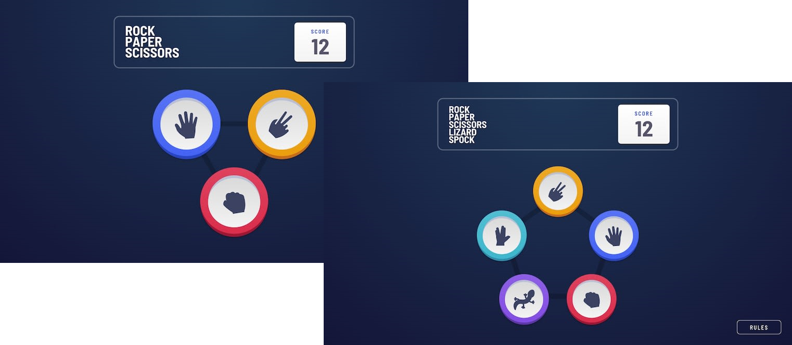

## Rock_Paper_Scissors_game

A simple game with the computer, taken from the idea of the rock, Paper, Scissors game. We want to make an idea similar to it with the computer in a fun and entertaining way, and get it looking as close to the design as possible.

**To do this game, we needed a basic of HTML, CSS and JavaScript.**

Your users should be able to:

- View the optimal layout for the game depending on their device's screen size.
- Play Rock, Paper, Scissors against the computer.
- Maintain the state of the score after refreshing the browser.
- Play Rock, Paper, Scissors, Lizard, Spock against the computer.

### Rule
according to rules of each game, of the player wins, they gain 1 point. If the computer wins, the player loses one point.

### Rules of First game:

<li>Paper beats Rock</li>
<li>Rock beats Scissors</li>
<li>Scissors beats Paper</li>

### Rules of Second game:

<li>Scissors beats Paper</li>
<li>Paper beats Rock</li>
<li>Rock beats Lizard</li>
<li>Lizard beats Spock</li>
<li>Spock beats Scissors</li>
<li>Scissors beats Lizard</li>
<li>Paper beats Spock</li>
<li>Rock beats Scissors</li>
<li>Lizard beats Paper</li>
<li>Spock beats Rock</li>

#### Let's go to play this game👏🔥
